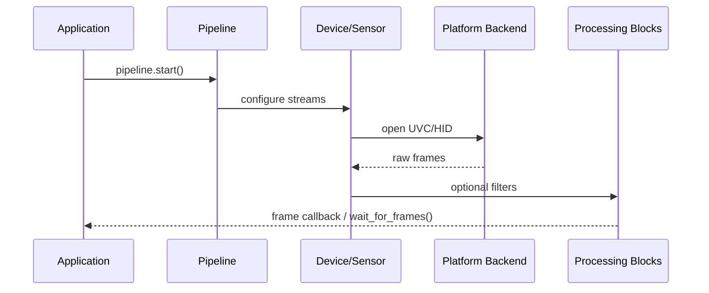

# librealsense 프로젝트 분석

> 분석 일자: 2026-06-18  
> 로컬 경로: `d:\study\librealsense`  
> SDK 버전: **2.58.2** (`include/librealsense2/rs.h`)

---

## 1. 프로젝트 개요

**librealsense**는 Intel RealSense™ 깊이 카메라(D400, D500 시리즈 등)를 위한 **크로스 플랫폼 오픈소스 SDK**입니다. Apache 2.0 라이선스로 배포되며, 공식 저장소는 [realsenseai/librealsense](https://github.com/realsenseai/librealsense)입니다.

### 핵심 기능

- 깊이(Depth) / 컬러(Color) / IR / IMU 스트리밍
- 내부·외부 파라미터(캘리브레이션) 제공
- 후처리 필터(정렬, 공간/시간 필터, 포인트클라우드 등)
- 녹화·재생(ROS bag / ROS2 bag)
- 펌웨어 업데이트, 고급 모드(Advanced Mode)
- DDS 기반 원격 카메라 접근(선택 빌드)

### 지원 언어 바인딩

C, C++, Python(pyrealsense2), C#, Unity, Matlab, Android 등 — `wrappers/` 디렉터리에 정리

---

## 2. 로컬 저장소 상태

| 항목 | 값 |
|------|-----|
| 현재 브랜치 | `master` |
| 원격 | `origin` → `https://github.com/artzy/librealsense.git` (포크) |
| 최근 커밋 | `9d7cc8ed9` — Push 2.58.2 to master (#15206) |
| 기본 개발 브랜치(업스트림) | `development` |

> 업스트림 기준 PR/커밋은 `development` 브랜치를 대상으로 합니다. 포크 원격(`artzy`)과 업스트림(`realsenseai`)이 다를 수 있으니 작업 전 브랜치·리모트를 확인하세요.

---

## 3. 디렉터리 구조

```
librealsense/
├── include/librealsense2/   # 공개 C/C++ API 헤더
├── src/                     # 핵심 라이브러리 (realsense2)
├── common/                  # Viewer 등 GUI 공통 코드
├── examples/                # SDK 사용 예제
├── tools/                   # realsense-viewer, fw-updater 등
├── wrappers/                # Python, C#, Unity, OpenCV 등
├── unit-tests/              # Python 기반 통합/단위 테스트
├── third-party/             # rsutils, json, glfw, realdds 등
├── CMake/                   # 빌드 설정·플랫폼별 매크로
├── doc/                     # 설치·사용 문서
├── scripts/                 # 플랫폼별 설치/패치 스크립트
└── .github/                 # CI, Copilot/스킬 가이드
```

---

## 4. 아키텍처 (레이어)

```
┌─────────────────────────────────────────────────────────────┐
│  Application Layer                                          │
│  (Examples, Tools, Wrappers, 사용자 앱)                      │
├─────────────────────────────────────────────────────────────┤
│  Public C/C++ API                                           │
│  include/librealsense2/  (rs.h, rs.hpp, h/, hpp/)           │
├─────────────────────────────────────────────────────────────┤
│  Core Library (src/)                                        │
│  context → device → sensor → stream → frame                 │
├─────────────────────────────────────────────────────────────┤
│  Processing Pipeline (src/proc/, src/pipeline/)            │
│  포맷 변환, 정렬, 필터, 동기화, 포인트클라우드               │
├─────────────────────────────────────────────────────────────┤
│  Platform Abstraction (src/platform/, src/backend.h)        │
│  UVC, HID, USB, MIPI, device_watcher                        │
├─────────────────────────────────────────────────────────────┤
│  Platform Backends                                          │
│  Windows: WMF / WinUSB    Linux: V4L2 / libusb              │
│  macOS/Android: RS USB backend                              │
└─────────────────────────────────────────────────────────────┘
```

### 4.1 핵심 객체 계층

```
librealsense::context        // 장치 검색·관리
└── device_interface         // 하드웨어 장치
    └── sensor_interface     // 개별 센서 (depth, color, IMU 등)
        ├── stream_profile   // 해상도·FPS·포맷 설정
        └── frame            // 프레임 데이터 (참조 카운트)
```

**Pipeline API** (`src/pipeline/`)은 위 계층을 단순화해 `rs2::pipeline` 한 줄로 스트리밍을 시작할 수 있게 합니다.

### 4.2 주요 인터페이스

| 인터페이스 | 역할 |
|-----------|------|
| `device_interface` | 모든 장치의 기본 클래스 |
| `sensor_interface` | 센서 스트리밍·옵션 |
| `frame_interface` | 프레임 데이터 |
| `option_interface` | 노출, 게인 등 설정 옵션 |
| `backend` (platform) | OS별 UVC/HID/USB 추상화 |

### 4.3 장치 계열 (src/ds/)

| 디렉터리 | 대상 |
|---------|------|
| `ds/d400/` | D400 시리즈 (D435, D455, D405 등) |
| `ds/d500/` | D500 시리즈 (D555 PoE, D457 GMSL, D585 Safety 등) |
| `ds/features/` | 공통 기능 (AE ROI, gain limit, IR pattern 제거 등) |
| `ds/advanced_mode/` | JSON 기반 고급 모드·프리셋 |

### 4.4 후처리 (src/proc/)

- **정렬**: depth ↔ color align (`align.cpp`, SSE/CUDA/NEON 최적화)
- **필터**: spatial, temporal, decimation, hole filling, HDR merge
- **변환**: disparity, colorizer, pointcloud, units transform
- **동기화**: `syncer-processing-block`
- **SIMD**: `sse/`, `neon/`, `cuda/` 서브디렉터리

### 4.5 미디어 (src/media/)

- ROS bag / ROS2 bag 녹화·재생
- `BUILD_ROSBAG2` 기본 ON

### 4.6 DDS (선택)

- `BUILD_WITH_DDS=ON` 시 FastDDS 연동
- `src/dds/`, `third-party/realdds/`, `tools/dds/`

---

## 5. 공개 API

### C API

- 진입점: `include/librealsense2/rs.h`
- 세부 헤더: `h/rs_context.h`, `h/rs_device.h`, `h/rs_sensor.h`, `h/rs_frame.h`, `h/rs_pipeline.h` 등
- 오류: `rs2_error*` out-parameter

### C++ API

- 진입점: `include/librealsense2/rs.hpp`
- 래퍼: `hpp/rs_*.hpp` — C API를 RAII/예외 기반으로 감쌈
- 오류: `rs2::error` 예외

### 버전 정책

- `RS2_API_PATCH_VERSION`만 다르면 ABI 호환
- 현재: **2.58.2**

---

## 6. 빌드 시스템

- **CMake** 최소 3.10 (DDS 사용 시 3.16.3)
- 타깃 라이브러리: `realsense2` (공유/정적 선택)
- C++14 (코어), 공개 API는 C++11 호환

### 주요 CMake 옵션

| 플래그 | 기본값 | 설명 |
|--------|--------|------|
| `BUILD_SHARED_LIBS` | ON | 공유 라이브러리 |
| `BUILD_EXAMPLES` | ON | 예제 빌드 |
| `BUILD_GRAPHICAL_EXAMPLES` | ON | Viewer, DQT |
| `BUILD_TOOLS` | ON | fw-updater, enumerate-devices 등 |
| `BUILD_PYTHON_BINDINGS` | OFF | pyrealsense2 |
| `BUILD_UNIT_TESTS` | OFF | 단위 테스트 |
| `FORCE_RSUSB_BACKEND` | OFF | RS USB 백엔드 (Win7/macOS/Android 필수) |
| `BUILD_WITH_DDS` | OFF | DDS 지원 |
| `BUILD_WITH_CUDA` | OFF | CUDA 가속 |
| `BUILD_GLSL_EXTENSIONS` | ON | OpenGL 확장 |

### Windows 빌드 (요약)

```powershell
mkdir build
cd build
cmake .. -DCMAKE_BUILD_TYPE=Release
cmake --build . --config Release
```

상세: `.github/skills/build.md`, `doc/installation_windows.md`

### 플랫폼별 백엔드

| OS | 기본 백엔드 |
|----|------------|
| Windows 10/11 | WMF (`src/mf/`) |
| Windows 7 | WinUSB UVC (`src/win7/`) |
| Linux | V4L2 (`src/linux/`) + libusb |
| macOS / Android | RS USB (`src/rsusb-backend/`, `src/libuvc/`) |

---

## 7. 예제 (examples/)

| 예제 | 설명 |
|------|------|
| `hello-realsense` | 최소 시작 코드 |
| `capture` | 프레임 캡처 |
| `align` / `align-advanced` | Depth-Color 정렬 |
| `pointcloud` | 3D 포인트클라우드 |
| `post-processing` | 필터 체인 |
| `record-playback` | bag 녹화/재생 |
| `motion` | IMU 데이터 |
| `multicam` | 다중 카메라 |
| `object-detection` | 객체 검출 프레임 |
| `software-device` | 소프트웨어 가상 장치 |
| `C/` | 순수 C API 예제 |

---

## 8. 도구 (tools/)

| 도구 | 용도 |
|------|------|
| `realsense-viewer` | GUI 뷰어, 녹화, 튜닝 |
| `depth-quality` | 깊이 품질 측정 |
| `fw-updater` / `fw-logger` | 펌웨어 관리 |
| `enumerate-devices` | 연결 장치 나열 |
| `terminal` | HWM 터미널 |
| `recorder` / `convert` | 녹화·변환 |
| `rosbag-inspector` | bag 파일 검사 |
| `dds/` | DDS 어댑터·스니퍼·설정 |

---

## 9. 래퍼 (wrappers/)

| 래퍼 | 기술 |
|------|------|
| `python/` | pybind11 → PyPI `pyrealsense2` |
| `csharp/` | .NET 바인딩 |
| `unity/` | Unity 플러그인 |
| `opencv/` | OpenCV 연동 예제 |
| `pcl/` | Point Cloud Library |
| `openvino/` | OpenVINO 추론 예제 |
| `android/` | Android JNI/Java |
| `matlab/` | Matlab MEX |
| `rest-api/` | REST API + React 뷰어 |
| `open3d/`, `tensorflow/`, `dlib/` | ML/CV 생태계 연동 |

---

## 10. 테스트 (unit-tests/)

- 오케스트레이터: `run-unit-tests.py`
- Python 프레임워크 + pytest 마이그레이션 진행 중
- 하드웨어 필요 live 테스트: `unit-tests/live/`
- DDS 테스트: `unit-tests/dds/`
- rsutils 단위 테스트: C++ (Catch 기반)

빌드 전제:

```powershell
cmake .. -DBUILD_UNIT_TESTS=ON -DBUILD_PYTHON_BINDINGS=ON
```

---

## 11. 서드파티 (third-party/)

| 패키지 | 용도 |
|--------|------|
| `rsutils` | JSON, 로깅, OS 유틸 (공개 링크) |
| `realsense-file` | bag 파일 I/O, LZ4 |
| `realdds` | DDS 프로토콜 (선택) |
| `json` | nlohmann/json |
| `glfw`, `imgui` | Viewer UI |
| `easyloggingpp` | 로깅 |
| `hidapi`, libuvc | USB/HID |

---

## 12. 코딩 규약

| 항목 | 규칙 |
|------|------|
| 네임스페이스 | `librealsense`, `librealsense::platform` |
| 파일명 | kebab-case (`backend-v4l2.h`) |
| 클래스 | snake_case (`uvc_device`) |
| C API enum | `rs2_*` 접두사 |
| 인터페이스 | `*_interface` 접미사 |
| 팩토리 | `*_factory` 접미사 |

### 스레딩

- context, device, sensor: **thread-safe**
- 프레임 콜백: **내부 스레드**에서 실행 → 블로킹 금지
- 센서당 독립 스트리밍 스레드

### 메모리

- RAII, `shared_ptr` / `unique_ptr`
- 프레임 풀링 + 참조 카운트

---

## 13. 데이터 흐름 (스트리밍)



---

## 14. Windows 개발 시 참고

1. **Visual Studio 2019/2022** + CMake
2. Viewer/DQT 빌드 시 OpenGL·GLFW 의존
3. Release 모드 Qt 디버그 로그: `qInfo()` + `#include <QDebug>`
4. Git 작업: 업스트림 `development` 기준 PR, 포크 `origin`에 push

---

## 15. 학습·탐색 추천 경로

1. `README.md` — 빠른 시작
2. `examples/hello-realsense/` — Pipeline API
3. `include/librealsense2/hpp/rs_pipeline.hpp` — C++ 고수준 API
4. `src/context.cpp` → `src/device.cpp` → `src/sensor.cpp` — 코어 흐름
5. `src/ds/d400/d400-device.cpp` — D400 장치 구현
6. `src/proc/align.cpp` — Depth-Color 정렬
7. `.github/copilot-instructions.md` — 프로젝트 공식 가이드
8. `.github/skills/build.md` — 빌드 상세

---

## 16. 요약

| 관점 | 평가 |
|------|------|
| 규모 | 대형 C++ SDK (~2000 파일), 다플랫폼·다장치 |
| 아키텍처 | 명확한 레이어 분리 (API → Core → Proc → Platform) |
| 확장성 | 장치별 `ds/d400`, `ds/d500` 모듈, feature 패턴 |
| 성능 | SSE/AVX, NEON, CUDA 경로 |
| 생태계 | Python/C#/Unity/OpenCV 등 풍부한 래퍼 |
| 빌드 | CMake 옵션으로 기능 선택적 빌드 |
| 테스트 | 하드웨어 의존 live 테스트 + Python 인프라 |

librealsense는 **RealSense 하드웨어와 OS를 연결하는 미들웨어 SDK**이며, 애플리케이션 개발자는 Pipeline/Processing API에, 플랫폼·장치 지원 작업자는 `src/ds/`와 `src/platform/` 계층을 중심으로 탐색하면 됩니다.
