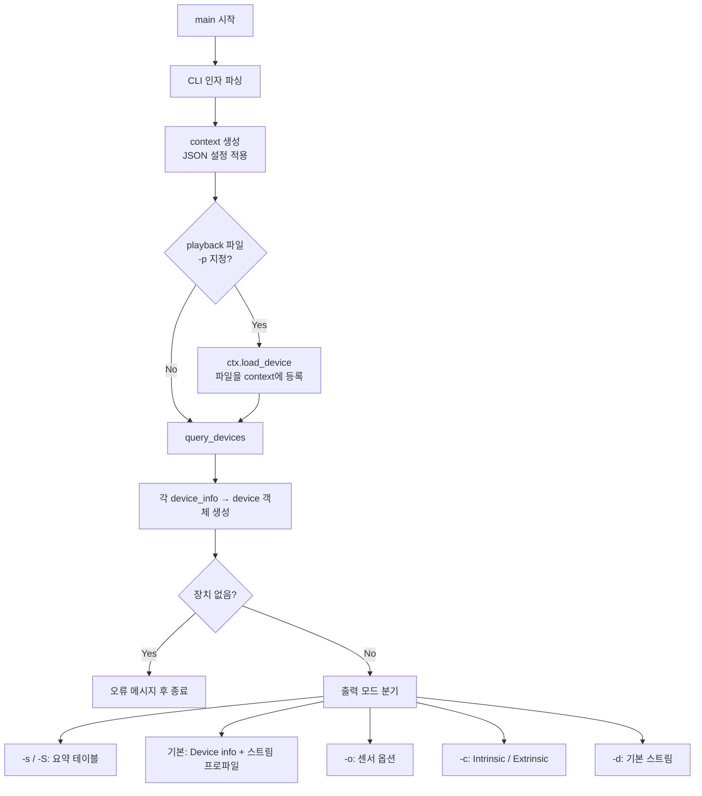

# rs-enumerate-devices.exe 작동 원리

## 개요

`rs-enumerate-devices`는 librealsense SDK의 **콘솔 진단 도구**입니다. USB/네트워크(DDS)에 연결된 RealSense 장치, 또는 `.bag` 녹화 파일(playback)을 **열지 않고(스트리밍 시작 없이)** 메타데이터만 조회해 출력합니다.

- 소스: `tools/enumerate-devices/rs-enumerate-devices.cpp`
- 빌드: CMake로 `realsense2` 라이브러리 + `tclap`(CLI 파싱)에 링크

---

## 전체 실행 흐름



---

## 1단계: 명령줄 파싱

`common/cli.h`의 `cli` 클래스(TCLAP 기반)로 인자를 처리합니다.

| 플래그 | 역할 |
|--------|------|
| `-s` / `--short` | 장치당 한 줄(이름, SN, FW) |
| `-S` / `--compact` | 위 테이블 + 짧은 Device info |
| `-o` / `--option` | 센서별 지원 옵션(min/max/step/default) |
| `-c` / `--calib_data` | Intrinsic / Extrinsic 캘리브레이션 |
| `-p` / `--playback_device` | `.bag` 파일을 가상 장치로 등록 |
| `-d` / `--defaults` | 기본(is_default) 스트림 표시 |
| `--sw-only` | 소프트웨어 장치(DDS, playback)만 |
| `--format` | format-conversion 설정(raw/basic/full) |
| `--no-dds` | DDS 장치 조회 비활성화 |
| `-v` / `--verbose` | 스트림 프로파일 UID 등 상세 출력 |

**충돌 규칙:** `-s`/`-S`는 `-o`, `-c`와 함께 쓰면 경고만 출력하고 옵션/캘리브 출력은 무시됩니다. `-p`와는 함께 사용 가능합니다.

---

## 2단계: SDK Context 초기화

```cpp
settings["dds"] = { { "enabled", show_dds } };
context ctx( settings.dump() );
```

`rs2::context`는 librealsense의 **진입점**입니다.

1. 전역 설정 파일(`RS2_CONFIG_FILENAME`, AppData) 로드
2. CLI에서 넘긴 JSON 설정과 병합
3. **Device Factory** 생성:
   - `backend_device_factory` — USB/UVC/HID/MIPI 등 물리 장치
   - `rsdds_device_factory` — DDS 네트워크 장치 (BUILD_WITH_DDS 시)

---

## 3단계: 장치 열거(Enumeration)

### 3-1. Playback 파일 (`-p`)

```cpp
if (!playback_dev_file.empty())
    d = ctx.load_device(playback_dev_file.data());
```

`load_device()` → `rs2_context_add_device()` → context의 `_user_devices`에 등록됩니다. 이후 `query_devices()` 결과에 포함됩니다.

### 3-2. 연결 장치 조회

```cpp
int mask = RS2_PRODUCT_LINE_ANY_INTEL;
if (only_sw_arg.getValue())
    mask |= RS2_PRODUCT_LINE_SW_ONLY;
auto devices_list = ctx.query_devices(mask);
```

호출 체인:

```
rs-enumerate-devices
  → rs2::context::query_devices(mask)
    → rs2_query_devices_ex()
      → librealsense::context::query_devices()
        → 각 factory->query_devices(mask)
        → _user_devices (playback 등)
```

#### backend_device_factory (물리 장치)

플랫폼 백엔드에서 하드웨어를 스캔합니다.

```
backend->query_uvc_devices()
backend->query_usb_devices()
backend->query_mipi_devices()
backend->query_hid_devices()
```

수집된 그룹에서 제품 라인별로 `device_info`를 생성합니다.

- D400: `d400_info::pick_d400_devices()`
- D500: `d500_info::pick_d500_devices()`
- Recovery 모드: `fw_update_info::pick_recovery_devices()`
- Non-Intel UVC: `platform_camera_info::pick_uvc_devices()`

Windows에서는 WMF/WinUSB, Linux에서는 V4L2/libusb 등 **플랫폼 추상화 계층**이 실제 USB 디스크립터를 읽습니다.

#### rsdds_device_factory (DDS, 선택 빌드)

네트워크상 RealSense DDS 참여자를 discovery합니다.

### 3-3. device_info → device

```cpp
for (auto i = 0u; i < devices_list.size(); i++)
    devices.emplace_back(devices_list[i]);
```

`device_list[i]`는 `device_info::create_device()`로 **실제 device 객체**를 만듭니다.  
이때 USB 통신 채널이 열리고, 펌웨어와 handshake하여 **메타데이터(이름, SN, 지원 프로파일 등)** 를 읽을 수 있게 됩니다.  
**스트리밍(`sensor.start()`)은 호출하지 않습니다.**

### 3-4. SW-only 대기

`--sw-only`일 때 DDS 연결 지연을 고려해 최대 3초(1초×3) 재시도합니다.

---

## 4단계: 정보 출력

각 `rs2::device`에 대해 순회하며 출력합니다.

### Device info (기본, `-S` 이상)

```cpp
for (auto j = 0; j < RS2_CAMERA_INFO_COUNT; ++j)
    if (dev.supports(param))
        cout << rs2_camera_info_to_string(param) << ": " << dev.get_info(param);
```

`RS2_CAMERA_INFO_*` enum 전체를 순회합니다.  
이름, 시리얼, 펌웨어, Physical Port, Product Id, USB 타입, Product Line 등.

### 스트림 프로파일 (기본 모드)

```cpp
for (auto&& sensor : dev.query_sensors())
    output_modes(sensor.get_stream_profiles(), verbose, show_defaults);
```

- 각 **센서**(Depth, RGB, IMU 등)의 `stream_profile` 목록
- 해상도, 포맷, FPS
- `verbose`: UID/IDX 포함
- `-d`: 기본 프로파일에 `+` 표시
- `debug_stream_sensor`: 디버그 전용 모드 추가 출력

### 옵션 (`-o`)

```cpp
for (auto j = 0; j < RS2_OPTION_COUNT; ++j)
    if (sensor.supports(opt))
        sensor.get_option_range(opt);  // min, max, step, default
```

노출/게인, 레이저 파워, HDR 등 **하드웨어 제어 옵션** 범위.

### 캘리브레이션 (`-c`)

1. **Video Intrinsic**: `video_stream_profile::get_intrinsics()`  
   - width/height, PPX/PPY, Fx/Fy, 왜곡 모델, 계수, FOV
2. **Motion Intrinsic**: IMU bias/noise/sensitivity
3. **Extrinsic**: 모든 스트림 쌍에 대해 `get_extrinsics_to()`  
   - 회전 행렬 + translation 벡터

동일 intrinsic을 공유하는 포맷은 그룹화해 출력합니다.

---

## SDK 계층과의 관계

```
┌─────────────────────────────────────┐
│  rs-enumerate-devices.exe (도구)     │
│  - CLI 파싱, 포맷팅, stdout 출력       │
└─────────────────┬───────────────────┘
                  │ rs2::context, device, sensor
┌─────────────────▼───────────────────┐
│  librealsense2 (Public C++ API)      │
│  rs.hpp / rs_context.hpp             │
└─────────────────┬───────────────────┘
                  │ rs2_query_devices_ex, create_device
┌─────────────────▼───────────────────┐
│  Core (context, device_factory)      │
│  backend_device_factory, d400/d500   │
└─────────────────┬───────────────────┘
                  │ query_uvc/usb/hid
┌─────────────────▼───────────────────┐
│  Platform Backend (Win/Linux/macOS)  │
│  USB/UVC/HID 드라이버                  │
└─────────────────────────────────────┘
```

---

## 종료 코드

| 코드 | 의미 |
|------|------|
| 0 (`EXIT_SUCCESS`) | 정상, 장치 정보 출력 완료 |
| 1 (`EXIT_FAILURE`) | 장치 없음, RealSense API 예외, 기타 std::exception |

---

## 다른 도구와의 차이

| 도구 | 역할 |
|------|------|
| `rs-enumerate-devices` | **정적 메타데이터** 조회 (연결 확인, 지원 모드, 캘리브) |
| `realsense-viewer` | GUI, 실시간 스트리밍·시각화 |
| `rs-fw-update` | 펌웨어 업데이트 |
| Pipeline API 예제 | `config.enable_stream()` 후 **프레임 수신** |

---

## 요약

`rs-enumerate-devices.exe`는 **librealsense Context → Device Factory → Platform Backend** 경로로 연결된 RealSense(및 playback/DDS) 장치를 찾고, 각 device/sensor의 **정적 capability**를 API로 읽어 콘솔에 포맷팅해 출력하는 **얇은 CLI 래퍼**입니다. 카메라 스트림을 시작하지 않으며, 장치 진단·호환성 확인·캘리브레이션 덤프·CI/스크립트 자동화에 적합합니다.
