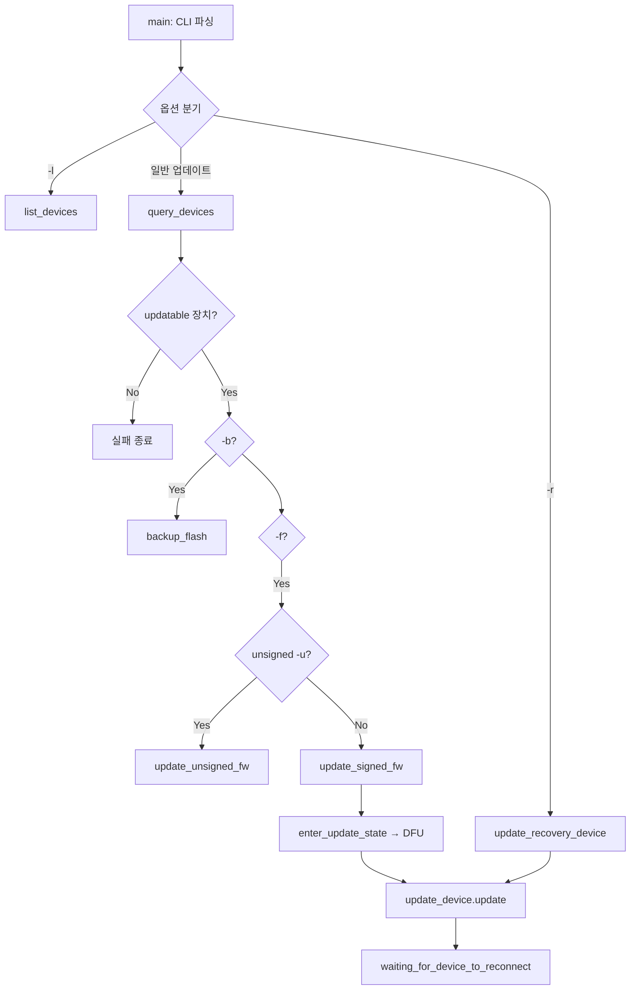

# rs-fw-update.exe 기능 설명

## 개요

`rs-fw-update`는 Intel RealSense 깊이 카메라의 **펌웨어(FW)를 업데이트·복구**하는 librealsense 콘솔 도구입니다.

- 소스: `tools/fw-update/rs-fw-update.cpp`
- 공통 유틸: `common/fw-update-common.h`
- 빌드: `realsense2` + `tclap` 링크

`rs-enumerate-devices`와 달리 **장치 상태를 변경**합니다. DFU(Device Firmware Update)를 수행하므로 Viewer 등 다른 RealSense 앱과 **동시 실행하면 안 됩니다.**

---

## 주요 기능

| 기능 | CLI | 설명 |
|------|-----|------|
| 장치 목록 | `-l` | 연결된 장치·펌웨어 버전·update serial 출력 |
| 서명 FW 업데이트 | `-f <bin>` | 정상 모드 장치에 서명된 `.bin` 이미지 적용 |
| Recovery 복구 | `-r -f <bin>` | Recovery 모드(D4XX Recovery) 장치 복구 |
| Flash 백업 | `-b <path>` | 카메라 플래시 내용을 파일로 저장 |
| Unsigned FW | `-u -f <bin>` | 잠금 해제(unlocked) 카메라 전용 비서명 FW |
| 장치 지정 | `-s <SN>` | 여러 대 연결 시 시리얼로 대상 선택 |

인자 없이 실행하면 `-h` 안내 후 **장치 목록만** 출력하고 종료합니다.

---

## 명령줄 옵션

| 플래그 | 설명 |
|--------|------|
| `-l` | 연결 장치 목록 후 종료 |
| `-f <path>` | 펌웨어 `.bin` 파일 경로 (Intel 서명 이미지) |
| `-s <serial>` | 업데이트 대상 시리얼 (2대 이상일 때 필수) |
| `-r` | Recovery 모드 장치 복구 |
| `-b <path>` | 플래시 백업 저장 경로 |
| `-u` | unsigned 펌웨어 (unlocked 카메라만) |
| `--debug` | librealsense 디버그 로그 |
| `--sw-only` | readme에 명시 (소프트웨어 장치만) |

---

## 실행 흐름



---

## 1. 장치 목록 (`-l`)

```cpp
auto devs = ctx.query_devices();
print_device_info(d);  // 설명, update serial, FW 버전, SMCU FW(지원 시)
```

출력 예:

```
1) [USB] Intel RealSense D435IF s/n 038322070306, update serial number: 039223050231, firmware version: 5.15.1
```

Recovery 모드 예:

```
1) [0ADB] Intel RealSense D4XX Recovery, update serial number: 039223050231, firmware version: 5.16.0.1
```

---

## 2. 서명 펌웨어 업데이트 (`-f`)

### 단계

1. **FW 파일 읽기** — `read_fw_file()`로 `.bin` 바이너리 로드
2. **호환성 검사** — `updatable::check_firmware_compatibility()` (D555 등)
3. **업데이트 모드 진입** — `updatable::enter_update_state()` (MIPI/GMSL 제외)
4. **DFU 수행** — `update_device::update(fw_image, progress_callback)`
5. **재연결 대기** — `set_devices_changed_callback` + 최대 15초 대기
6. **완료 확인** — 새 FW 버전 출력

### MIPI(GMSL) 장치

`is_mipi_device()` — Connection type이 `GMSL`이면 `enter_update_state()` 생략, 별도 경로.

### USB 2.0 경고

USB Type Descriptor에 `2.`가 포함되면 USB 3 포트 사용을 권장하는 경고 출력.

---

## 3. Recovery 모드 복구 (`-r -f`)

펌웨어 업데이트 중단·손상 등으로 **D4XX Recovery** 상태인 장치를 복구합니다.

1. `is_in_recovery_mode()` 장치 검색
2. 복수 Recovery 장치면 `-s`(update serial) 필수
3. `update(recovery_device, fw_image)` — Recovery 장치에 직접 DFU
4. `devices_changed_callback`으로 **정상 모드 재등장** 대기 (15초)
5. D457 MIPI Recovery(`Product Id: BBCD`)는 재부팅/드라이버 reload 안내

```cpp
// fw-update-common.h
mipi_recovery_message =
    "For GMSL MIPI device please reboot, or reload d4xx driver\n"
    "sudo rmmod d4xx && sudo modprobe d4xx";
```

Recovery 장치에 일반 `-f`만 쓰면:

```
Device is in recovery mode, use -r to recover
```

---

## 4. Flash 백업 (`-b`)

```cpp
flash = d.as<rs2::updatable>().create_flash_backup(progress_callback);
file.write(flash.data(), flash.size());
```

업데이트 전 카메라 플래시 전체를 파일로 저장. 장치/펌웨어에 따라 미지원일 수 있음.

---

## 5. Unsigned 펌웨어 (`-u -f`)

```cpp
d.as<rs2::updatable>().update_unsigned(fw_image, callback);
```

**Camera Locked = NO** 등 잠금 해제된 카메라만. 개발·커스텀 FW용.

---

## SDK API 사용

| API | 역할 |
|-----|------|
| `rs2::context::query_devices()` | 장치 검색 |
| `rs2::device::is_in_recovery_mode()` | Recovery 여부 |
| `rs2::updatable::enter_update_state()` | DFU 모드 전환 |
| `rs2::updatable::check_firmware_compatibility()` | FW-장치 호환 |
| `rs2::update_device::update()` | 서명 FW DFU |
| `rs2::updatable::update_unsigned()` | 비서명 FW |
| `rs2::updatable::create_flash_backup()` | 플래시 덤프 |
| `context::set_devices_changed_callback()` | 재연결 감지 |

---

## 제약·주의사항

1. **동시 사용 금지** — Viewer, 다른 스트리밍 앱과 병행 실행 금지
2. **서명 FW 필수** — 일반 업데이트는 Intel `Signed_Image_UVC_*.bin` 필요
3. **다중 장치** — 2대 이상이면 `-s` 필수
4. **업데이트 중 연결 유지** — "Please don't disconnect device!"
5. **재연결 타임아웃** — `WAIT_FOR_DEVICE_TIMEOUT` = 15초
6. **Recovery vs 일반** — Recovery는 `-r`, 일반은 `-f` (자동 구분 안 됨)

---

## rs-enumerate-devices와 비교

| | rs-enumerate-devices | rs-fw-update |
|--|---------------------|--------------|
| 목적 | 조회·진단 | FW 업데이트·복구 |
| 장치 상태 변경 | ❌ | ✅ (DFU, Recovery) |
| Recovery 복구 | ❌ | ✅ `-r` |
| Flash 백업 | ❌ | ✅ `-b` |
| USB 문제 자동 복구 | ❌ | Recovery 모드만 `-r`로 복구 |

---

## 사용 예

```powershell
# 장치 목록
rs-fw-update -l

# 단일 장치 업데이트
rs-fw-update -f Signed_Image_UVC_5_15_1_0.bin

# 시리얼 지정
rs-fw-update -s 038322070306 -f Signed_Image_UVC_5_15_1_0.bin

# Recovery 복구
rs-fw-update -r -f Signed_Image_UVC_5_15_1_0.bin

# 업데이트 전 백업
rs-fw-update -s 038322070306 -b backup.bin -f Signed_Image_UVC_5_15_1_0.bin
```

펌웨어 다운로드: [Intel D400 FW](https://downloadcenter.intel.com/download/28870/Latest-Firmware-for-Intel-RealSense-D400-Product-Family?product=128255)
