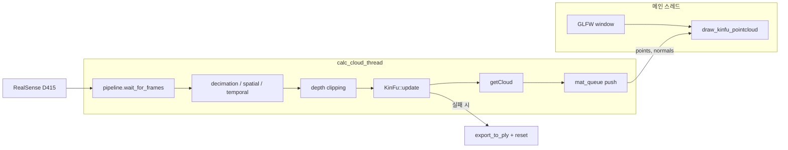

# rs-kinfu 프로젝트 분석

> 분석 대상: `wrappers/opencv/kinfu/` (소스)  
> 참고: `build/wrappers/opencv/kinfu/` 는 CMake 빌드 산출물 경로이며, 소스는 `wrappers/opencv/kinfu/` 에 있습니다.

---

## 1. 개요

**rs-kinfu** 는 Intel RealSense 깊이 카메라의 프레임을 OpenCV **KinectFusion(KinFu)** 알고리즘에 넣어, 카메라를 움직이는 동안 실시간으로 3D 장면을 재구성하는 예제입니다.

| 항목 | 내용 |
|------|------|
| 실행 파일 | `rs-kinfu.exe` |
| 핵심 알고리즘 | KinectFusion (ICP 기반 깊이 융합) |
| OpenCV 모듈 | `opencv_contrib` → `rgbd` → `cv::kinfu::KinFu` |
| 카메라 입력 | RealSense 깊이 스트림 1280×720, Z16 |
| 렌더링 | OpenGL + GLFW (`examples/example.hpp` 의 `window` 클래스) |

KinectFusion 원 논문: [ISMAR 2011 – KinectFusion](https://www.microsoft.com/en-us/research/wp-content/uploads/2016/02/ismar2011.pdf)  
OpenCV API: [cv::kinfu::KinFu](https://docs.opencv.org/trunk/d8/d1f/classcv_1_1kinfu_1_1KinFu.html)

---

## 2. 프로젝트 구조

```
wrappers/opencv/kinfu/
├── rs-kinfu.cpp      # 메인 소스 (단일 파일, ~355줄)
├── CMakeLists.txt    # 빌드 설정 (OpenCV contrib 전용 경로)
└── readme.md         # 사용법·코드 설명
```

상위 CMake에서 `BUILD_CV_KINFU_EXAMPLE=ON` 일 때만 포함됩니다.

```15:17:wrappers/opencv/CMakeLists.txt
if(BUILD_CV_KINFU_EXAMPLE)
    add_subdirectory(kinfu)
endif()
```

---

## 3. 아키텍처 (스레드·데이터 흐름)

### 3.1 전체 흐름



### 3.2 역할 분리

| 스레드 | 역할 |
|--------|------|
| **calc_cloud_thread** | 프레임 수집, 후처리, KinFu 갱신, 포인트클라우드 추출, 큐에 전달 |
| **메인 스레드** | GLFW 이벤트 루프, OpenGL 포인트클라우드 렌더링 |

스레드 간 통신은 `mat_queue` (mutex + `std::queue<Mat>`) 두 개로 이루어집니다.

- `points_queue` — 3D 좌표
- `normals_queue` — 법선 벡터

---

## 4. 소스 코드 상세

### 4.1 초기화 (main)

1. **KinFu 파라미터**: `Params::coarseParams()` 로 생성 (readme.md 는 `defaultParams()` 로 설명하지만 실제 코드는 `coarseParams()` 사용)
2. **RealSense 파이프라인**: 깊이 1280×720 Z16 스트림 시작
3. **센서 설정**: `RS2_RS400_VISUAL_PRESET_HIGH_DENSITY` 프리셋, `depth_scale` 획득
4. **후처리 필터**: decimation → spatial → temporal (기본 설정)
5. **KinFu 파라미터 설정**:
   - `frameSize`: decimation 적용 후 해상도
   - `intr`: 카메라 내부 파라미터 (fx, fy, ppx, ppy)
   - `depthFactor`: `1 / depth_scale` (Z16 raw → 미터 변환)
6. **OpenCL 비활성화**: `cv::ocl::setUseOpenCL(false)` — CPU 경로 강제
7. **KinFu 생성**: `KinFu::create(params)` (실패 시 stderr 출력 후 종료)

### 4.2 깊이 클리핑

```17:18:wrappers/opencv/kinfu/rs-kinfu.cpp
static float max_dist = 2.5;
static float min_dist = 0;
```

- `clipping_dist = max_dist / depth_scale` → raw depth 단위 임계값
- 임계값 초과 픽셀은 0으로 설정 (원거리 노이즈 제거)
- OpenMP `#pragma omp parallel for` 로 y 루프 병렬화

### 4.3 KinFu 처리 루프 (워커 스레드)

매 프레임:

1. `wait_for_frames()` → decimation / spatial / temporal
2. 클리핑
3. `Mat` → `UMat` 복사 (GPU 메모리)
4. `kf->update(frame)` — 실패 시:
   - `kf->reset()`
   - 이전 포인트클라우드를 `export_to_ply()` 로 저장
   - `after_reset = true` (다음 프레임까지 getCloud 생략)
5. 성공 시 `kf->getCloud(points, normals)` → CPU `Mat` 복사 → 큐 push

예외 발생(카메라 연결 해제 등) 시에도 `export_to_ply()` 호출.

### 4.4 렌더링

| 함수 | 역할 |
|------|------|
| `colorize_pointcloud` | Z 좌표를 JET 컬러맵으로 RGB 변환 |
| `draw_kinfu_pointcloud` | OpenGL `GL_POINTS` 로 포인트+법선 렌더링, 마우스 yaw/pitch/offset 적용 |
| `export_to_ply` | 바이너리 PLY 저장 (좌표, 법선, RGB) |

종료 시(`while (app)` 루프 탈출) 마지막 포인트클라우드도 PLY로 저장.

---

## 5. 빌드 시스템 (CMakeLists.txt)

### 5.1 CMake 옵션

| 옵션 | 기본값 | 설명 |
|------|--------|------|
| `BUILD_CV_EXAMPLES` | — | OpenCV 예제 전체 |
| `BUILD_CV_KINFU_EXAMPLE` | **OFF** | rs-kinfu 빌드 여부 |
| `BUILD_GRAPHICAL_EXAMPLES` | ON | GLFW/OpenGL 예제 (필수) |

### 5.2 OpenCV 의존성 (특수 설정)

일반 `find_package(OpenCV)` 와 달리, KinFu 전용 캐시 변수를 사용합니다.

```cmake
KINFU_OPENCV_ROOT = "D:/Dev2019/opencv-4.9.0"  # CACHE PATH
```

- **opencv_contrib** 의 `rgbd` 모듈(`kinfu.hpp`)이 포함된 OpenCV 설치본 필요
- 버전 접미사: `4.13` → `4130`, `4.9` → `490`
- `x64/vc16/lib` 없으면 `x64/vc17/lib` 로 폴백
- 링크: `opencv_rgbd`, `calib3d`, `features2d`, `flann`, `imgproc`, `core`
- POST_BUILD: 해당 OpenCV DLL 6개를 exe 출력 폴더로 복사
- MSVC: `/NODEFAULTLIB:glfw3dll.lib` (정적 glfw3 와 충돌 방지)

### 5.3 링크 대상

- `realsense2`, `glfw`, `OpenGL::GL`
- OpenCV contrib 라이브러리 (위 6개)
- `examples/example.hpp`, `third-party/imgui` 소스 포함

---

## 6. OpenCV 빌드 요구사항

KinFu는 **특허 알고리즘** 이라 OpenCV 빌드 시 아래가 필요합니다.

1. **opencv_contrib** 클론 (OpenCV 버전과 동일 브랜치)
2. CMake:
   - `OPENCV_EXTRA_MODULES_PATH` = `opencv_contrib/modules`
   - **`OPENCV_ENABLE_NONFREE=ON`** ← 필수
3. `rgbd` 모듈 포함 확인 후 빌드·설치
4. librealsense 재설정:

```powershell
cmake -S d:\study\librealsense -B d:\study\librealsense\build `
  -G "Visual Studio 17 2022" -A x64 `
  -DBUILD_CV_EXAMPLES=ON `
  -DBUILD_CV_KINFU_EXAMPLE=ON `
  -DKINFU_OPENCV_ROOT=D:/Dev2019/opencv_contrib-4.13.0/install

cmake --build d:\study\librealsense\build --config Release --target rs-kinfu
```

---

## 7. 실행 환경·로그에서 확인된 이슈

현재 `build/Release/` 의 진단 로그 기준:

### 7.1 NONFREE 미설정

```
OpenCV(4.13.0) ... kinfu.cpp:349: error: (-213:The function/feature is not implemented)
This algorithm is patented and is excluded in this configuration;
Set OPENCV_ENABLE_NONFREE CMake option and rebuild the library
```

→ OpenCV를 `OPENCV_ENABLE_NONFREE=ON` 으로 **재빌드**해야 KinFu 생성 가능.

### 7.2 OpenCL GPU 리소스 부족

```
OpenCL error CL_OUT_OF_RESOURCES (-5) during call:
clEnqueueNDRangeKernel('fillPtsNrm', dims=3, globalsize=512x512x512, localsize=8x8x16)
```

KinFu 내부 TSDF 볼륨(512³) GPU 커널 실행 시 VRAM/리소스 한계.  
코드에서 `cv::ocl::setUseOpenCL(false)` 를 설정했지만, KinFu 자체가 내부적으로 GPU 경로를 사용할 수 있어 GPU 메모리 부족 시 발생 가능.

**대응 방향**:
- `Params::coarseParams()` 대신 더 작은 볼륨의 커스텀 Params
- GPU 드라이버/VRAM 확인
- OpenCV KinFu CPU 전용 빌드 여부 확인

### 7.3 readme vs 실제 코드 차이

| 항목 | readme.md | rs-kinfu.cpp |
|------|-----------|--------------|
| Params | `defaultParams()` | `coarseParams()` |
| 클리핑 | `depth_scale * pixel` vs `clipping_dist`(미터) | `pixel > clipping_dist` (raw 단위, `clipping_dist = max_dist/depth_scale`) |

---

## 8. 사용자 인터랙션

- **마우스**: `glfw_state` 의 yaw/pitch/offset_y 로 시점 회전·이동 (`register_glfw_callbacks`)
- **창 크기**: 1280×720, 제목 `"RealSense KinectFusion Example"`
- **종료**: 창 닫기 → 워커 스레드 join → PLY 자동 저장

---

## 9. PLY 내보내기

저장 시점:
1. KinFu `update()` 실패 후 reset 직전
2. 워커 스레드 예외 발생 시
3. 애플리케이션 종료 시

파일명: `MMDDYY HHMMSS.ply` (로컬 시간)  
형식: binary little-endian, vertex + normal + RGB

> 참고: PLY 헤더의 `property float8 x` 형태는 `sizeof(float)*8` 문자열 연결 버그로 보이며, 표준 PLY 파서와 호환되지 않을 수 있습니다.

---

## 10. 다른 OpenCV 예제와의 비교

| 예제 | OpenCV 사용 | RealSense | GUI |
|------|-------------|-----------|-----|
| rs-imshow | core, imgproc | depth 표시 | imshow |
| rs-pointcloud | — | pointcloud | OpenGL |
| **rs-kinfu** | **contrib rgbd/kinfu** | depth fusion | OpenGL |

rs-kinfu만 **opencv_contrib + NONFREE + 별도 KINFU_OPENCV_ROOT** 가 필요합니다.

---

## 11. 빌드·실행 요약 (Windows)

```powershell
# 1. OpenCV + opencv_contrib (NONFREE=ON, rgbd 포함) 빌드
# 2. librealsense CMake
cmake -S d:\study\librealsense -B d:\study\librealsense\build `
  -G "Visual Studio 17 2022" -A x64 `
  -DBUILD_CV_EXAMPLES=ON `
  -DBUILD_CV_KINFU_EXAMPLE=ON `
  -DKINFU_OPENCV_ROOT=<contrib 포함 OpenCV 설치 경로>

cmake --build d:\study\librealsense\build --config Release --target rs-kinfu

# 3. 실행 (D415 연결, USB 3.x)
cd d:\study\librealsense\build\Release
.\rs-kinfu.exe
```

**기대 동작**: 창에 포인트클라우드가 표시되고, 카메라를 천천히 움직이면 주변 장면이 점진적으로 융합·확장됩니다.

---

## 12. 핵심 의존성 다이어그램

```
┌─────────────────────────────────────────────────────────┐
│                      rs-kinfu.exe                        │
├──────────────┬──────────────────┬───────────────────────┤
│ librealsense2│ OpenCV contrib   │ GLFW + OpenGL         │
│ (pipeline,   │ (rgbd/kinfu,     │ (example.hpp window,  │
│  filters)    │  imgproc, core…) │  pointcloud render)   │
└──────────────┴──────────────────┴───────────────────────┘
         │                │                    │
         ▼                ▼                    ▼
   RealSense SDK    OPENCV_ENABLE_NONFREE   BUILD_GRAPHICAL_EXAMPLES
                    + opencv_contrib rgbd
```

---

*분석 일자: 2026-06-18*
