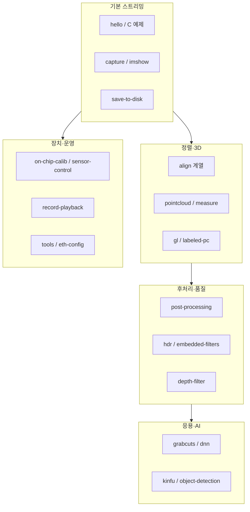

# librealsense 예제·도구 실행 파일 — 난이도·기능별 분류

> 작성: 2026-06-19  
> 기준: 공식 `examples/readme.md` 난이도(★) + 소스/readme 내용  
> D415 환경 빌드 현황은 `D415-예제-Windows-빌드-실행-가이드.md` 반영

---

## 1. 난이도 기준

| 등급 | 의미 | 학습에 필요한 개념 |
|------|------|-------------------|
| ★ 입문 | Pipeline 한 줄 시작, 단일 스트림·단순 출력 | `rs2::pipeline`, frame 읽기, colorizer |
| ★★ 중급 | 정렬·필터·동기화·3D 응용·녹화 등 | align, post-processing, projection, IMU |
| ★★★ 고급 | 저수준 API, GPU, 가상 장치, CV/AI 연동, 네트워크 | `rs2::sensor`, GLSL, software_device, OpenCV contrib |

---

## 2. 기능별 분류 (전체 맵)



---

## 3. SDK 예제 (`examples/`)

### 3.1 ★ [입문 — 기본 연결·스트리밍·표시](3.1-입문-기본연결스트리밍표시-핵심함수.md)

| 실행 파일 | 소스 | 기능 | UI | 핵심 API | D415 |
|-----------|------|------|-----|----------|------|
| rs-hello-realsense | [rs-hello-realsense.cpp](../examples/hello-realsense/rs-hello-realsense.cpp) | depth 중심값 콘솔 출력 | 콘솔 | pipeline.start(), get_depth_frame() | ✅ |
| rs-distance (C) | [rs-distance.c](../examples/C/distance/rs-distance.c) | hello와 동일 (C API) | 콘솔 | C pipeline API | ✅ |
| rs-color (C) | [rs-color.c](../examples/C/color/rs-color.c) | color 스트림 정보 출력 | 콘솔 | color stream | ✅ |
| rs-capture | [rs-capture.cpp](../examples/capture/rs-capture.cpp) | depth+color(+IR) 동시 GUI | OpenGL | enable_all_streams, colorizer | ✅ |
| rs-save-to-disk | [rs-save-to-disk.cpp](../examples/save-to-disk/rs-save-to-disk.cpp) | 프레임 PNG 등 파일 저장 (헤드리스) | 없음 | frame → disk | ✅ |
| rs-pointcloud | [rs-pointcloud.cpp](../examples/pointcloud/rs-pointcloud.cpp) | 텍스처 3D 포인트클라우드 | OpenGL | projection, pointcloud | ✅ |
| rs-multicam | [rs-multicam.cpp](../examples/multicam/rs-multicam.cpp) | 여러 카메라 depth 동시 표시 | OpenGL 다중 창 | context, 다중 pipeline | ✅ (카메라 2대+) |
| rs-on-chip-calib | [rs-on-chip-calib.cpp](../examples/on-chip-calib/rs-on-chip-calib.cpp) | 온칩 자동 캘리브레이션 실행 | 콘솔 | calibration API | ✅ |

**비교 요약**

- 가장 먼저: rs-hello-realsense → rs-capture (GUI 입문)
- C 언어: rs-distance, rs-color, rs-depth, rs-infrared
- 파일 저장만: rs-save-to-disk (서버·로봇 헤드리스 환경)

---

### 3.2 ★★ [중급 — 정렬·후처리·측정·녹화·IMU](3.2-중급-정렬후처리측정녹화IMU-핵심함수.md)

| 실행 파일 | 소스 | 기능 | UI | 핵심 API | D415 |
|-----------|------|------|-----|----------|------|
| rs-depth (C) | [rs-depth.c](../examples/C/depth/rs-depth.c) | depth ASCII 히트맵 | 콘솔 | depth stream | ✅ |
| rs-infrared (C) | [rs-infrared.c](../examples/C/infrared/rs-infrared.c) | 좌/우 IR ASCII 표시 | 콘솔 | IR1/IR2 Y8 | ✅ |
| rs-align | [rs-align.cpp](../examples/align/rs-align.cpp) | depth↔color 공간 정렬 | OpenGL | rs2::align | ✅ |
| rs-align-advanced | [rs-align-advanced.cpp](../examples/align-advanced/rs-align-advanced.cpp) | 정렬 + 동적 배경 제거 | OpenGL | align + threshold 마스크 | ✅ |
| rs-post-processing | [rs-post-processing.cpp](../examples/post-processing/rs-post-processing.cpp) | spatial/temporal 등 필터 비교 | OpenGL 3D | processing blocks | ✅ |
| rs-measure | [rs-measure.cpp](../examples/measure/rs-measure.cpp) | 3D 객체 치수 측정 | OpenGL | deproject, High Accuracy | ✅ |
| rs-record-playback | [rs-record-playback.cpp](../examples/record-playback/rs-record-playback.cpp) | .bag/.db3 녹화·재생 | OpenGL | record/playback device | ✅ |
| rs-motion | [rs-motion.cpp](../examples/motion/rs-motion.cpp) | IMU로 카메라 회전 추정 | OpenGL | gyro/accel (D435i 등) | ⚠️ D415 무 IMU |
| rs-hdr | [rs-hdr.cpp](../examples/hdr/rs-hdr.cpp) | depth HDR (다중 노출 병합) | OpenGL | HDR merge | ✅ (D400) |
| rs-labeled-pointcloud | [rs-labeled-pointcloud.cpp](../examples/labeledpointcloud/rs-labeled-pointcloud.cpp) | 라벨(클래스) 포인트클라우드 | OpenGL | labeled pointcloud | ✅ |
| rs-callback | [rs-callback.cpp](../examples/callback/rs-callback.cpp) | 콜백 기반 고빈도 스트리밍 | OpenGL | pipeline callback, mutex | ✅ |

**비교 요약**

| 목적 | 추천 예제 | 대안 |
|------|-----------|------|
| depth를 color 픽셀에 맞추기 | rs-align | rs-align-advanced (배경 제거) |
| 노이즈 줄이기 | rs-post-processing | Viewer 필터 패널 |
| 실제 거리·크기 재기 | rs-measure | - |
| camera 없이 반복 테스트 | rs-record-playback | sample .bag |
| IMU 융합 | rs-motion | D435i/L515 등 IMU 장치 필요 |

---

### 3.3 ★★★ [고급 — GPU·저수준 API·가상 장치·특수 기능](3.3-고급-GPU저수준API가상장치특수기능-핵심함수.md)

| 실행 파일 | 소스 | 기능 | UI | 핵심 API | D415 |
|-----------|------|------|-----|----------|------|
| rs-gl | [rs-gl.cpp](../examples/gl/rs-gl.cpp) | GPU 포인트클라우드·처리 | OpenGL+GLSL | realsense2-gl | ✅ |
| rs-align-gl | [rs-align-gl.cpp](../examples/align-gl/rs-align-gl.cpp) | GPU 정렬 | OpenGL+GLSL | GLSL align | ✅ |
| rs-sensor-control | [rs-sensor-control.cpp](../examples/sensor-control/rs-sensor-control.cpp) | 센서·옵션·프로파일 직접 제어 | ImGui | rs2::sensor, options | ✅ |
| rs-software-device | [rs-software-device.cpp](../examples/software-device/rs-software-device.cpp) | 가상 장치·합성 프레임 | OpenGL | software_device | ✅ |
| rs-embedded-filters | [rs-embedded-filters.cpp](../examples/embedded-filters/rs-embedded-filters.cpp) | 장치 내장 필터 옵션 RW | 콘솔 | embedded_filter | ⚠️ 장치 지원 여부 |
| rs-eth-config | [rs-eth-config.cpp](../examples/eth-config/rs-eth-config.cpp) | Ethernet 설정 (PoE 등) | 콘솔 | eth_config_device | ❌ D415 USB 전용 |
| rs-object-detection | [rs-object-detection.cpp](../examples/object-detection/rs-object-detection.cpp) | 추론 센서 결과 수신 | 콘솔 | inference stream (DDS) | ❌ 추론 센서 필요 |

**비교 요약**

- CPU 정렬 → rs-align / GPU 정렬 → rs-align-gl
- Pipeline 추상화 벗어나기 → rs-sensor-control
- 하드웨어 없이 파이프라인 테스트 → rs-software-device

---

## 4. [OpenCV 예제](4-OpenCV예제-핵심함수.md) (`wrappers/opencv/`)

> 빌드: `BUILD_CV_EXAMPLES=ON`, `OpenCV_DIR` 지정

| 실행 파일 | 소스 | 난이도 | 기능 | OpenCV 활용 | D415 빌드 |
|-----------|------|--------|------|-------------|-----------|
| rs-imshow | [rs-imshow.cpp](../wrappers/opencv/imshow/rs-imshow.cpp) | ★ | colorized depth OpenCV 창 | Mat zero-copy, imshow | ✅ |
| rs-grabcuts | [rs-grabcuts.cpp](../wrappers/opencv/grabcuts/rs-grabcuts.cpp) | ★★★ | depth 초기값 + GrabCut 전경 분리 | align, GrabCut | ✅ |
| rs-latency-tool | [rs-latency-tool.cpp](../wrappers/opencv/latency-tool/rs-latency-tool.cpp) | ★★★ | 화면 패턴으로 지연 추정 | 패턴 인식 | ✅ |
| rs-dnn | [rs-dnn.cpp](../wrappers/opencv/dnn/rs-dnn.cpp) | ★★ | MobileNet-SSD + depth 거리 | dnn, depth meters | ✅ |
| rs-depth-filter | [rs-depth-filter.cpp](../wrappers/opencv/depth-filter/rs-depth-filter.cpp) | ★★★ | 드론 충돌회피용 고신뢰 depth | 커스텀 필터 체인 | ✅ |
| rs-rotate-pc | [rs-rotate-pc.cpp](../wrappers/opencv/rotate-pointcloud/rs-rotate-pc.cpp) | ★★ | 포인트클라우드 회전 후 colorize | projection + 회전 | ✅ |
| rs-kinfu | [rs-kinfu.cpp](../wrappers/opencv/kinfu/rs-kinfu.cpp) | ★★★ | KinectFusion 실시간 3D 재구성 | opencv_contrib rgbd | ❌ contrib 필요 |

**기능 비교 (OpenCV 계열)**

| 예제 | 소스 | rs-align과 차이 | 적합한 용도 |
|------|------|-----------------|-------------|
| rs-imshow | [rs-imshow.cpp](../wrappers/opencv/imshow/rs-imshow.cpp) | 표시만, 정렬 없음 | OpenCV 연동 Hello World |
| rs-grabcuts | [rs-grabcuts.cpp](../wrappers/opencv/grabcuts/rs-grabcuts.cpp) | 픽셀 단위 최적화 분할 | 깔끔한 전경 추출 |
| rs-align-advanced | [rs-align-advanced.cpp](../examples/align-advanced/rs-align-advanced.cpp) | 단순 depth threshold 마스크 | 실시간 빠른 배경 제거 |
| rs-dnn | [rs-dnn.cpp](../wrappers/opencv/dnn/rs-dnn.cpp) | 2D 검출 + depth 거리 | 객체 인식 프로토타입 |
| rs-depth-filter | [rs-depth-filter.cpp](../wrappers/opencv/depth-filter/rs-depth-filter.cpp) | 학술 논문 기반 outdoor 필터 | outdoor drone OA |
| rs-kinfu | [rs-kinfu.cpp](../wrappers/opencv/kinfu/rs-kinfu.cpp) | 누적 3D 모델 | 실내 스캔·SLAM 입문 |

---

## 5. [선택 빌드 예제](5-선택빌드예제-wrappers-핵심함수.md) (wrappers/)

| 실행 파일 | 소스 | 위치 | 난이도 | 기능 | 빌드 조건 |
|-----------|------|------|--------|------|-----------|
| rs-pcl | [rs-pcl.cpp](../wrappers/pcl/pcl/rs-pcl.cpp) | wrappers/pcl | ★★ | PCL 포인트클라우드 뷰어 | PCL, BUILD_PCL_EXAMPLES |
| rs-pcl-color | [rs-pcl-color.cpp](../wrappers/pcl/pcl-color/rs-pcl-color.cpp) | wrappers/pcl | ★★ | RGB PCL 처리 | 동일 |
| rs-pointcloud-stitching | [rs-pointcloud-stitching.cpp](../wrappers/pointcloud/pointcloud-stitching/rs-pointcloud-stitching.cpp) | wrappers/pointcloud | ★★★ | 다중 카메라 PC 스티칭 | BUILD_PC_STITCHING |
| RealSenseBagReader | [RealSenseBagReader.cpp](../wrappers/open3d/cpp/RealSenseBagReader.cpp) | wrappers/open3d | ★★ | Open3D bag 읽기 | Open3D, BUILD_OPEN3D_EXAMPLES |
| RealSenseRecorder | [RealSenseRecorder.cpp](../wrappers/open3d/cpp/RealSenseRecorder.cpp) | wrappers/open3d | ★★ | Open3D 녹화 | 동일 |
| rs-face-dlib | [rs-face-dlib.cpp](../wrappers/dlib/face/rs-face-dlib.cpp) | wrappers/dlib | ★ | 얼굴 인식 + anti-spoof | Dlib |
| rs-face-vino | [rs-face-vino.cpp](../wrappers/openvino/face/rs-face-vino.cpp) | wrappers/openvino | ★~★★ | OpenVINO 얼굴 인식 | OpenVINO |
| rs-dnn-vino | [rs-dnn-vino.cpp](../wrappers/openvino/dnn/rs-dnn-vino.cpp) | wrappers/openvino | ★~★★ | OpenVINO DNN 검출 | OpenVINO |

---

## 6. [도구](6-도구-tools-핵심함수.md) (`tools/`) — 예제 vs 실무

예제는 **API 학습**, 도구는 **장치 운영·디버깅**에 가깝습니다.

| 실행 파일 | 소스 | 난이도 | 기능 | 예제와의 관계 |
|-----------|------|--------|------|---------------|
| realsense-viewer | [viewer-main.cpp](../tools/realsense-viewer/viewer-main.cpp) | ★ (사용) | 공식 GUI — 스트림·녹화·캘리브·Advanced Mode | 모든 예제의 GUI 상위 대체 |
| rs-enumerate-devices | [rs-enumerate-devices.cpp](../tools/enumerate-devices/rs-enumerate-devices.cpp) | ★ | 연결 장치·센서·옵션 나열 | rs-sensor-control 전 확인용 |
| rs-depth-quality | [rs-depth-quality.cpp](../tools/depth-quality/rs-depth-quality.cpp) | ★★ | depth 품질 메트릭 (fill rate, RMS 등) | rs-post-processing 결과 검증 |
| rs-record | [rs-record.cpp](../tools/recorder/rs-record.cpp) | ★★ | CLI 녹화 (.db3) | rs-record-playback CLI版 |
| rs-convert | [rs-convert.cpp](../tools/convert/rs-convert.cpp) | ★★ | bag ↔ db3 등 변환 | 녹화 후처리 |
| rs-data-collect | [rs-data-collect.cpp](../tools/data-collect/rs-data-collect.cpp) | ★★ | 프레임 통계 CSV | 성능·안정성 분석 |
| rs-fw-update | [rs-fw-update.cpp](../tools/fw-update/rs-fw-update.cpp) | ★★ | 펌웨어 업데이트 | - |
| rs-terminal | [rs-terminal.cpp](../tools/terminal/rs-terminal.cpp) | ★★★ | HWM·펌웨어 명령 | 하드웨어 디버깅 |
| rs-fw-logger | [rs-fw-logger.cpp](../tools/fw-logger/rs-fw-logger.cpp) | ★★★ | 내부 카메라 로그 | 이슈 리포트 |
| rs-embed | [rs-embed.cpp](../tools/embed/rs-embed.cpp) | ★★★ | 펌웨어 임베드 | OEM |
| rs-rosbag-inspector | [rs-rosbag-inspector.cpp](../tools/rosbag-inspector/rs-rosbag-inspector.cpp) | ★★ | legacy .bag 검사 | Foxglove(db3) 대안 |
| rs-benchmark | [rs-benchmark.cpp](../tools/benchmark/rs-benchmark.cpp) | ★★★ | 성능 벤치마크 | - |
| rs-dds-sniffer | [rs-dds-sniffer.cpp](../tools/dds/dds-sniffer/rs-dds-sniffer.cpp) | ★★★ | DDS 도메인 스니핑 | BUILD_WITH_DDS |
| rs-dds-adapter | [rs-dds-adapter.cpp](../tools/dds/dds-adapter/rs-dds-adapter.cpp) | ★★★ | DDS 어댑터 | BUILD_WITH_DDS |
| rs-dds-config | [rs-dds-config.cpp](../tools/dds/dds-config/rs-dds-config.cpp) | ★★★ | DDS 설정 | BUILD_WITH_DDS |

---

## 7. 난이도별 학습 로드맵 (D415 기준)

### 7.1 ★ 입문 코스 (1~2일)

```
rs-hello-realsense → rs-capture → rs-imshow → rs-pointcloud
```

| 단계 | 배우는 것 |
|------|-----------|
| hello | Pipeline, depth 값 |
| capture | 다중 스트림, OpenGL GUI |
| imshow | OpenCV Mat 연동 |
| pointcloud | 3D projection |

### 7.2 ★★ 중급 코스 (3~5일)

```
rs-align → rs-post-processing → rs-measure → rs-record-playback → rs-hdr
```

선택: rs-align-advanced, rs-dnn, rs-callback

### 7.3 ★★★ 고급 코스

```
rs-sensor-control → rs-gl → rs-grabcuts / rs-depth-filter → rs-kinfu(빌드 후)
```

부가: Python Advanced Mode, rs-software-device

---

## 8. 기능 축 횡단 비교

### 8.1 "화면에 depth 보여주기"

| 실행 파일 | 소스 | 라이브러리 | 스트림 | 특징 |
|-----------|------|-----------|--------|------|
| rs-hello-realsense | [rs-hello-realsense.cpp](../examples/hello-realsense/rs-hello-realsense.cpp) | - | depth | 숫자 1개 (콘솔) |
| rs-capture | [rs-capture.cpp](../examples/capture/rs-capture.cpp) | OpenGL | depth+color | 공식 다중 스트림 GUI |
| rs-imshow | [rs-imshow.cpp](../wrappers/opencv/imshow/rs-imshow.cpp) | OpenCV | depth only | 최소 코드 (~50줄) |
| realsense-viewer | [viewer-main.cpp](../tools/realsense-viewer/viewer-main.cpp) | ImGui+GL | 전체 | 설정·녹화 포함 |

### 8.2 "배경 제거"

| 실행 파일 | 소스 | 방식 | 품질 | 속도 |
|-----------|------|------|------|------|
| rs-align-advanced | [rs-align-advanced.cpp](../examples/align-advanced/rs-align-advanced.cpp) | depth threshold | 보통 | 빠름 |
| rs-grabcuts | [rs-grabcuts.cpp](../wrappers/opencv/grabcuts/rs-grabcuts.cpp) | GrabCut 최적화 | 높음 | 느림 |
| rs-depth-filter | [rs-depth-filter.cpp](../wrappers/opencv/depth-filter/rs-depth-filter.cpp) | 고신뢰 depth만 사용 | outdoor 특화 | 중간 |

### 8.3 "3D 표현"

| 실행 파일 | 소스 | 출력 | GPU | 누적 모델 |
|-----------|------|------|-----|-----------|
| rs-pointcloud | [rs-pointcloud.cpp](../examples/pointcloud/rs-pointcloud.cpp) | 텍스처 PC | CPU GL | 프레임 단위 |
| rs-labeled-pointcloud | [rs-labeled-pointcloud.cpp](../examples/labeledpointcloud/rs-labeled-pointcloud.cpp) | 클래스별 색 PC | CPU GL | 프레임 단위 |
| rs-gl | [rs-gl.cpp](../examples/gl/rs-gl.cpp) | GPU PC | GLSL | 프레임 단위 |
| rs-kinfu | [rs-kinfu.cpp](../wrappers/opencv/kinfu/rs-kinfu.cpp) | fusion volume | OpenCV CUDA(옵션) | 장면 누적 |
| rs-measure | [rs-measure.cpp](../examples/measure/rs-measure.cpp) | 측정선·치수 | CPU GL | - |

### 8.4 "정렬 (align)"

| 실행 파일 | 소스 | 구현 | 비고 |
|-----------|------|------|------|
| rs-align | [rs-align.cpp](../examples/align/rs-align.cpp) | CPU rs2::align | 기본 학습용 |
| rs-align-gl | [rs-align-gl.cpp](../examples/align-gl/rs-align-gl.cpp) | GPU GLSL | 고해상도·고FPS |
| rs-grabcuts | [rs-grabcuts.cpp](../wrappers/opencv/grabcuts/rs-grabcuts.cpp) | align 후 OpenCV | 2D 분할용 전처리 |

---

## 9. D415 환경 빠른 참조

### 빌드 완료 (ALL_BUILD + OpenCV)

- SDK 예제 전부 (IMU·Ethernet·object-detection 제외 실행 의미)
- OpenCV: imshow, grabcuts, latency-tool, dnn, depth-filter, rotate-pc
- 도구: viewer, depth-quality, enumerate-devices, fw-update, terminal 등

### 추가 빌드 필요

| 실행 파일 | 소스 | 필요 조건 |
|-----------|------|-----------|
| rs-kinfu | [rs-kinfu.cpp](../wrappers/opencv/kinfu/rs-kinfu.cpp) | opencv_contrib rgbd, BUILD_CV_KINFU_EXAMPLE=ON |
| rs-pcl | [rs-pcl.cpp](../wrappers/pcl/pcl/rs-pcl.cpp) | PCL |
| rs-pointcloud-stitching | [rs-pointcloud-stitching.cpp](../wrappers/pointcloud/pointcloud-stitching/rs-pointcloud-stitching.cpp) | BUILD_PC_STITCHING=ON |
| Open3D 예제 | [RealSenseBagReader.cpp](../wrappers/open3d/cpp/RealSenseBagReader.cpp) 등 | Open3D 0.12+ |
| rs-dds-* | [tools/dds/](../tools/dds/) | BUILD_WITH_DDS=ON |

### D415에서 의미 없거나 제한적

| 실행 파일 | 소스 | 이유 |
|-----------|------|------|
| rs-motion | [rs-motion.cpp](../examples/motion/rs-motion.cpp) | D415에 IMU 없음 |
| rs-eth-config | [rs-eth-config.cpp](../examples/eth-config/rs-eth-config.cpp) | USB 카메라 |
| rs-object-detection | [rs-object-detection.cpp](../examples/object-detection/rs-object-detection.cpp) | 추론 센서·DDS 장치 필요 |

---

## 10. 한눈에 보는 매트릭스

| 분류 | ★ 입문 | ★★ 중급 | ★★★ 고급 |
|------|--------|---------|----------|
| 스트리밍 | hello, capture, imshow, save-to-disk | callback, infrared | sensor-control |
| 2D GUI | capture, multicam | align, align-adv, hdr | grabcuts |
| 3D | pointcloud | measure, labeled-pc | gl, kinfu, rotate-pc |
| 필터 | on-chip-calib | post-processing, hdr | depth-filter, embedded-filters |
| AI/CV | - | dnn | grabcuts, object-detection |
| 데이터 | save-to-disk | record-playback | convert, software-device |
| 운영 | enumerate-devices, viewer | fw-update, depth-quality | terminal, fw-logger |

---

*공식 난이도 출처: examples/readme.md Experience Level*
